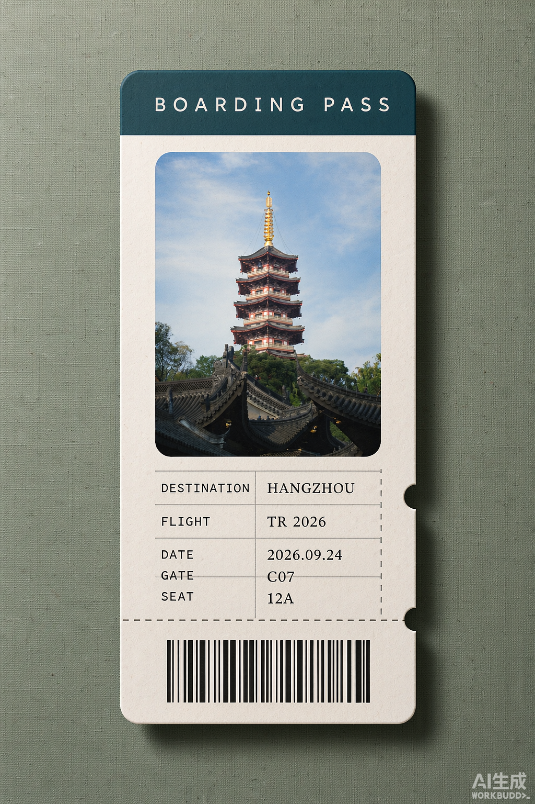
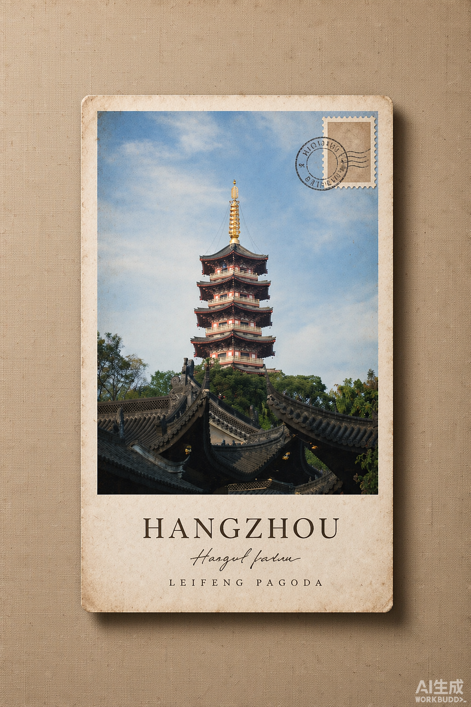
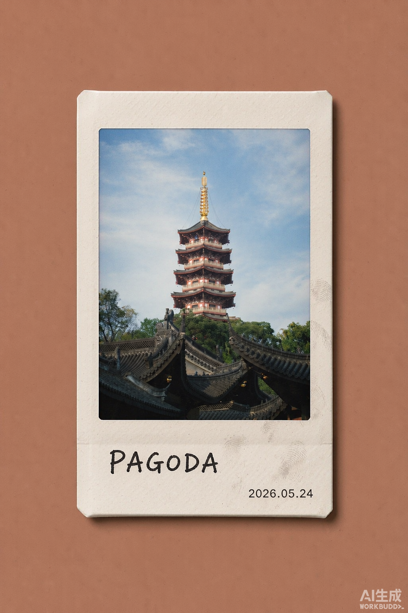

# Travel Ticket 旅行票根 Skill（多样式版）

把旅行或日常照片转换成具有收藏感的复古纪念海报。提供五种版式，可以指定一种，也可以一次请求多种样式、分别输出。

本 fork 基于 [zczc1001/artifact-template-travel-ticket](https://github.com/zczc1001/artifact-template-travel-ticket) 扩展了多样式支持，保留 `$artifact-template-travel-ticket` 调用名称和默认旅行票根行为。

> A reusable Codex image template that turns photos into vintage keepsake posters — five layouts included.


## 五种样式

| 样式 ID | 名称 | 画面比例 | 版式要点 |
|---|---|---|---|
| `travel-ticket` | 旅行票根（默认） | 3:4 竖版 | 米白纸票、圆角照片窗、齿孔与撕票虚线、地点与编号、装饰条形码 |
| `boarding-pass` | 登机牌 | 3:4 竖版 | 深色抬头色带、照片窗、DESTINATION/FLIGHT/GATE/SEAT 字段网格、条形码 |
| `postcard` | 复古明信片 | 3:4 竖版 | 近乎满幅照片、做旧卡纸纹理、右上角邮票与圆形邮戳、手写体寄语 |
| `instant-film` | 拍立得 | 3:4 竖版 | 厚白框、宽下巴、圆角画面微褪色、马克笔手写地点 |
| `film-frame` | 胶片帧 | 3:2 **横版** | 近黑片基、上下齿孔、单帧画面、蚀刻片边编号与尘点 |

### 样式参考图

顶部预览展示默认旅行票根。下面是新增样式的版式与材质参考，不代表同一张照片的生成结果。

| 登机牌 | 复古明信片 |
| --- | --- |
|  |  |

| 拍立得 | 胶片帧 |
| --- | --- |
|  |  |

## 效果特点

- 明确指定样式优先，不指定则使用默认旅行票根；一次请求多种时，每种单独生成，不混合版式
- 半自适应背景：每张输出独立从原图提取协调色，降低饱和度后用于背景，不固定为参考图中的蓝色；缺少明确色彩线索时使用暖灰或石色
- 胶片帧例外：外围保留近黑片基，不使用织物背景；半自适应规则仅用于照片自身的色彩呈现
- 保留原照片的主体、构图和可识别细节
- 地点文字控制在 12 个字符以内；编号、日期等内容按所选版式和用户提供的信息安排，不为填满版式编造事实
- 齿孔、撕票线、条形码、邮戳、片边编号均为装饰元素，不代表真实票证或可扫描条码

样式名称不明确或不在支持范围内时，Skill 会选择最接近的已有样式，并说明实际使用的样式。

## 安装方法

### 方法一：让 Codex 安装

把本 fork 的仓库地址发给支持 Skill 安装的 Codex 环境：

```text
请安装这个 Skill：
https://github.com/N5Tar/artifact-template-travel-ticket
```

### 方法二：手动安装

1. 从[本 fork](https://github.com/N5Tar/artifact-template-travel-ticket) 的 **Code → Download ZIP** 下载源码，或克隆本仓库。
2. 将解压后的目录重命名为 `artifact-template-travel-ticket`，放入当前 Codex 环境的个人 skills 目录。保留 `SKILL.md`、`artifact-template.json`、`agents/` 和完整的 `assets/` 目录结构。
3. 新建一个 Codex 任务，上传照片并使用 `$artifact-template-travel-ticket` 调用。

本 Skill 依赖运行环境提供 `$imagegen` 图像生成能力，本身不包含独立的图像生成程序。若已安装上游同名 Skill，请先备份，再用此 fork 替换，避免同名版本冲突。

## 使用示例

先上传原照片，再输入提示词。参考图提供版式、材质与光影，原照片提供主体内容和配色来源。

### 指定样式（推荐）

```text
使用 $artifact-template-travel-ticket 把这张照片做成「拍立得」风格。

地点英文：SUZHOU
编号：NO.2027
背景：从照片主色中自动提取低饱和颜色
主体必须保留：桥、船和远处塔楼
输出：1080×1440 PNG
```

### 胶片帧（横版）

```text
使用 $artifact-template-travel-ticket 把这张照片做成「胶片帧」。

地点英文：SUZHOU
保留原照片主体，外围使用近黑片基和上下齿孔。
输出：3:2 横版 PNG，期望尺寸 1536×1024
```

### 一次要齐五种

```text
使用 $artifact-template-travel-ticket，这张照片每种样式都来一张，分别输出五张图片。
地点英文：SUZHOU
旅行票根、登机牌、明信片、拍立得用 3:4 竖版；胶片帧用 3:2 横版。
```

也可以只请求其中几种，例如「登机牌和明信片各一张」。每张独立处理配色，不强制所有输出使用同一种背景色。示例中的像素尺寸是输出请求，实际支持的尺寸以运行环境的图像生成能力为准。

### 不指定样式（沿用旧行为）

```text
使用 $artifact-template-travel-ticket 把这张照片制作成旅行票根海报。

地点英文：SUZHOU
编号：NO.2027
输出：1080×1440 PNG
```

支持识别的别名：票根 / ticket、登机牌 / boarding pass、明信片 / postcard、拍立得 / polaroid / instant film、胶片 / 35mm / negative。

## 自定义与扩展

新增样式时，需要同步配置、参考图和 Skill 指令：

1. 制作该版式的参考图，放入 `assets/styles/你的样式.png`，保留已有参考图不变。
2. 在 [artifact-template.json](artifact-template.json) 的 `variants` 中添加一项，按现有结构填写 `id`、`name`、`aliases`、`reference`、`preview`、`canvas`、`orientation`。资源路径相对于 Skill 根目录；`preview` 可以复用参考图。
3. 在 [SKILL.md](SKILL.md) 的「Styles」表格中补充样式，在「Per-style layout keys」中说明版式要点、文字区域和背景规则，并同步样式数量、描述及选择规则中的相关表述。
4. 同步本 README 的样式表、预览、示例与文件结构，以及 [agents/openai.yaml](agents/openai.yaml) 中的展示名称、简介和默认提示词。
5. 检查所有参考图路径可用，在具备图像生成能力的环境中分别验证新样式、默认样式和多样式请求，目视检查主体保真、文字及比例。

保留当前默认行为时，不要改动 `defaultStyle` 或顶层 `reference`、`preview`；它们仍指向旅行票根。参考图定义视觉版式和材质，`SKILL.md` 定义选择方式、内容保真及配色等规则。

## 文件结构

```text
artifact-template-travel-ticket/
├── SKILL.md
├── artifact-template.json
├── agents/
│   └── openai.yaml
└── assets/
    ├── preview.png
    ├── reference.png          # 默认样式 travel-ticket
    └── styles/
        ├── boarding-pass.png
        ├── postcard.png
        ├── instant-film.png
        └── film-frame.png
```

## 许可证

MIT License。你可以使用、修改和分享本 Skill，但请保留许可证文本。本仓库基于 https://github.com/zczc1001/artifact-template-travel-ticket 扩展了多样式支持。
